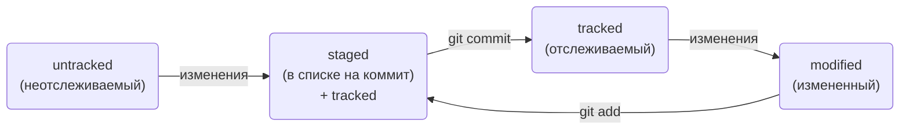
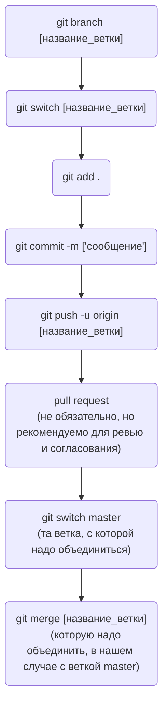

# 1. Командная строка
### 1) Навигация
pwd (от англ. print working directory, «показать рабочую папку») — покажи, в какой я папке;  
ls (от англ. list directory contents, «отобразить содержимое директории») — покажи файлы и папки в текущей папке;  
ls -a — покажи также скрытые файлы и папки;  
ls -la — покажи также скрытые файлы и папки списком;  
cd first-project (от англ. change directory, «сменить директорию») — перейди в папку first-project;  
cd first-project/html — перейди в папку html, которая находится в папке first-project;  
cd .. — перейди на уровень выше, в родительскую папку;  
cd ~ — перейди в домашнюю директорию (/Users/Username);  
cd / — перейди в корневую директорию; 
 
Работа с файлами и папками  

### 2) Создание
touch index.html (англ. touch, «коснуться») — создай файл index.html в текущей папке;  
touch index.html style.css script.js — если нужно создать сразу несколько файлов, можно напечатать их имена в одну строку через пробел;  
mkdir second-project (от англ. make directory, «создать директорию») — создай папку с именем second-project в текущей папке.  
### 3) Копирование и перемещение  
cp file.txt ~/my-dir (от англ. copy, «копировать») — скопируй файл в другое место;  
mv file.txt ~/my-dir (от англ. move, «переместить») — перемести файл или папку в другое место.  
### 4) Чтение  
cat file.txt (от англ. concatenate and print, «объединить и распечатать») — распечатай содержимое текстового файла file.txt. 
### 5) Удаление  
rm about.html (от англ. remove, «удалить») — удали файл about.html;  
rmdir images (от англ. remove directory, «удалить директорию») — удали папку images;  
rm -r second-project (от англ. remove, «удалить» + recursive, «рекурсивный») — удали папку second-project и всё, что она содержит.\  

# 2. Первый коммит

git init - создали репозиторий   
rm -rf .git - удалили подпапку .git если что-то пошло не так  
	ключ -r (от англ. recursive — «рекурсивно») позволяет удалять папки вместе с их содержимым;  
	ключ -f (от англ. force — «заставить») избавит вас от вопросов вроде «Вы точно хотите удалить этот файл?;  
git status - узнать текущий статус файлов в репозитории:  
+ инициализирован ли репозиторий
+ какая ветвь активна
+ какие файлы отслеживаются
+ какие будут добавлены в коммит
+ а какие не будут
git add - Подготовить файлы к сохранению, git add --all # подготовили к сохранению все файлы в репозитории;  
git commit -m ['комментарий к коммиту в кавычках'];    
git commit --amend --no-edit - не создаст новый коммит , а дополнит последний;  
git commit --amend -m "Новое сообщение"  -  изменить сообщение коммита     
Самая распространенная ошибка при попытке коммита, это забыть подготовить к коммиту(git add), иначе коммит не получится;  
git log - Просмотреть историю коммитов(git log --oneline - сокращенная версии - удобно);    

git restore --staged example.txt(git restore --staged . - сбросит все файлы в папке) - откатит в статус untracked/modified;   
git reset --hard [commit hash] - откатить коммит(можно использовать короткий хэш коммита);      
git restore [file] - откатит файл, которые не попали ни в staged, ни в коммит;  
git diff [commit hash] [commit hash] - покажет что нового было добавлено между коммитами;  
git diff - изменения последних коммитов;  
git diff --staged - изм в sataged файлах;  

# 3. Удалённый репозиторий
SSH — протокол, который обеспечивает безопасный обмен данными в сети и использует для этого ключи;    
SSH-ключ — ваш виртуальный идентификатор в GitHub;    
SSH-ключ состоит из двух частей — публичной и приватной. Публичный ключ зашифрует данные, а приватный — расшифрует;    

### Инструкция по связыванию SSH-ключа и GitHub-аккаунта: 
1. $ ssh-keygen -t ed25519 -C "электронная почта, к которой привязан ваш аккаунт на GitHub" - генерации SSH-пары (жмем enter для подтверждения);  
2. ls -a ~/.ssh - проверка сгенерированных ключей(Файл в .pub — публичный, им можно делиться);  
3. $ clip < ~/.ssh/id_ed25519.pub - скопировать содержимое ключа в буфер обмена;  
4. Перейдите на GitHub и выберите пункт Settings  
5. В меню слева нажмите на пункт SSH and GPG keys.  
6. В открывшейся вкладке выберите New SSH key.  
7. Заполняем поля. В поле Key скопируйте ваш ключ из буфера обмена.  
8. Нажмите на кнопку Add SSH key.  
9. ssh -T git@github.com - Проверьте правильность ключа с помощью следующей команды.  
10. git remote add origin git@github.com:%ИМЯ_АККАУНТА%/first-project.git   
	Перейдите на страницу удалённого репозитория(Git Hub), выберите тип SSH и скопируйте URL(раширение .git)   
	Команде необходимо передать два параметра: имя удалённого репозитория и его URL. В качестве имени используйте слово origin  
11. git remote -v - Убедиться, что репозитории связаны, -v — короткая форма флага --verbose (англ. «подробный»)  
12. git push - Отправить изменения на удалённый репозиторий.  
	git push -u origin main - В первый раз эту команду нужно вызвать с флагом -u и параметрами origin.    
	В дальнейшем при работе с удалённым репозиторием флаг -u можно опустить и писать просто git push.    

# 4. Навигация по коммитам. Статусы файлов

### ХЭШ — идентификатор коммита
При вызове git log отображается хэш, пример 3ba8129fcdf7c200b23a7621d26ad58bf61fcd72. По нему можно найти инфу о коммите(когда и кем сделан).  
В команде git log --oneline используется сокращенный хэш, его тоже можно использовать.  
В числе прочих файлов в папке .git есть служебный файл HEAD. Он указывает на самый свежий коммит. Вместо хеша последнего коммита можно написать слово HEAD — Git вас поймёт.  

### Статусы файлов в Git
untracked - новые файлы в папке .git, которые не подготовили для отслеживания командой git add.    
staged - после выполнения git add, которые далее войдут в коммит.  
tracked - все файлы, которые отслеживает Git.  
modified - который был изменен относительно последнего коммита.  

Жизненный цикл файла  
 

### Игнорирование файлов в Git
.gitignore — это обычный текстовый файл. Его добавляют в корень репозитория и тоже коммитят(пользуются шаблонами).  
Если файл уже попал staged или коммит, то правило игнорирования для него не действует. Заполняется по строкам.     
*.jpeg - все файлы с расширением .jpeg будут игнорироваться, !doge.jpeg - исключить из игнорирования    
file?.txt - файлы с одним символом вместо "?" fileA.txt и file1.txt  
file[0-2].txt - игнорировать файлы file0.txt, file1.txt и file2.txt, но не file3.txt, file4.txt     
/todo.txt - игнорировать todo.txt в корне репозитория    
build/ - игнорировать папку build  
logs/**/debug.log - **-любой путь может быть вместо двух звезд  
git status --ignored - посмотреть какие файлы в игноре  

### Копирование репозиториев
1. чужой проект - сначала fork на него, появится этот репозиторий в твоих репохиториях  
2. $ git clone git@github.com:Simonov20/git-fork-case.git  
3. chmod +x check.sh - сделать файл исполняемым, можно перетянуть файл в консоль и файл пропишется с полным путем(или ./check.sh)  

### Ветки: создание, навигация, сравнение
git branch - просмотр веток и с отображением на какой ветке сейчас     
git branch [название_ветки] - создание ветки  
git checkout [название_ветки] - переключиться на другую ветку или **git switch**    
git checkout -b [название_ветки] - создать ветку и сразу переключиться на нее  
  Ветка указывает на коммит, который сделан в ней последним. Но новая ветка указывает старые коммиты, если в ней нет новых коммитов.  
git diff [название_ветки1] [название_ветки2] - показывает изменения в ветках  

#### Суффикс навигации ~
git diff HEAD~ HEAD - сравнивает последний и предпоследний коммит  
git diff 2ea56ab~ 2ea56ab - или использовать хеши так
git diff HEAD~2 git_branch_new - 2 коммита назад и последний коммит ветки git_branch_new   

git merge [название_ветки] - объединяет ветку с той, в которой находимся   
git branch -D [название_ветки] - удаляет ветку или -d щадящий режим, если удаляемая ветка полностью объединена с другой  

git push -u origin [название_новой_ветки] - добавление новой ветки на удаленный репозиторий GitHub  

### Pull request
Пул-реквест — это запрос на рассмотрение предлагаемых изменений и часть процесса ревью. Создать можно на GitHub или по ссылке в Git, которая создается после команды git push -u origin branch_new.   
Процесс создания ветки и слияние:  

 

### Слияние веток fast-forward
После git merge слияние происходит по принципу - "добавляй все коммиты в лоб" и не возможен конфликт, так как одна ветка становится продолжением другой.

.png)

